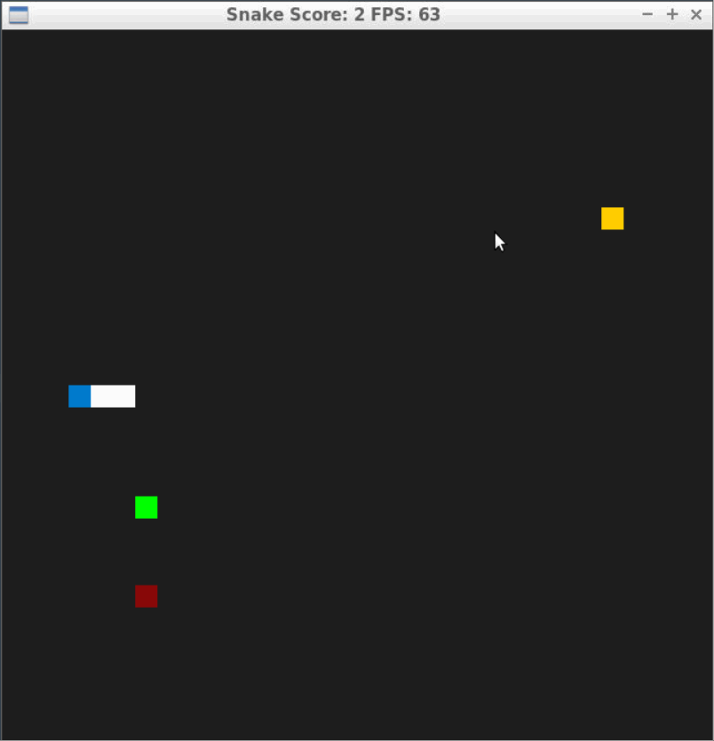

# CPPND: Capstone Snake Game Example

 The code for this repo was inspired by [this](https://codereview.stackexchange.com/questions/212296/snake-game-in-c-with-sdl) excellent StackOverflow post and set of responses. The game is modifies to include the features mentioned below by following cpp standard practices.

## New Features
* New Food Types:  
Four types of food added as part of this feature in the game. The Food is populated at non overlapping random locations. Other than Noraml food all other types of food can disappeare. Every consumption of Booster or Rotten food will extend effect duration by 5 seconds.
  * Normal Food : Increases speed and size of snake.
  * Booster Food : Increases the snake speed for 5 seconds. Changes the Snake body color to .
  * Rotten Food : Reverses the control of the snake for 5 seconds. Changes background color to .
  * Poison Food : Decreases the size and speed of snake.
* Pause Game:   
  * Pause the game on press of `ESC` key and update the message in title bar. 
  * The game can be resumed by pressing `ESC` key again.
  * When game paused timers for food effects on snake and food disappear also pauses.
* Wall around the game window:  
  * Wall can be toggled using `w` key. 
  * When game is paused wall cannot be toggled. 
  * When wall enabled snake cannot go around the game window it will result in death of snake.
  * When wall enabled the background colour changes to .
* Popup Box:
  * Popup box with score and size is displayed when snake dies.
  * Once the box is closed the the game window closes.

## Dependencies for Running Locally
* cmake >= 3.7
  * All OSes: [click here for installation instructions](https://cmake.org/install/)
* make >= 4.1 (Linux, Mac), 3.81 (Windows)
  * Linux: make is installed by default on most Linux distros
  * Mac: [install Xcode command line tools to get make](https://developer.apple.com/xcode/features/)
  * Windows: [Click here for installation instructions](http://gnuwin32.sourceforge.net/packages/make.htm)
* SDL2 >= 2.0
  * All installation instructions can be found [here](https://wiki.libsdl.org/Installation)
  >Note that for Linux, an `apt` or `apt-get` installation is preferred to building from source. 
* gcc/g++ >= 5.4
  * Linux: gcc / g++ is installed by default on most Linux distros
  * Mac: same deal as make - [install Xcode command line tools](https://developer.apple.com/xcode/features/)
  * Windows: recommend using [MinGW](http://www.mingw.org/)

## Basic Build Instructions

1. Clone this repo.
2. Make a build directory in the top level directory: `mkdir build && cd build`
3. Compile: `cmake .. && make`
4. Run it: `./SnakeGame`.

## Rubric Points covered

* Loops, Functions, I/O
  * The project code is organized in functions to avoid repeatation of code e.g. [snake.cpp#L56](./src/snake.cpp#L56) and control strctures are added to achiev the functionality e.g. [renderer.cpp#L67](./src/renderer.cpp#L67).
  * The Game accepts input for pause/resume game ([controller.cpp#L54](./src/controller.cpp#L54)) and enable/disable wall ([controller.cpp#L58](./src/controller.cpp#L58)). 
  * The project uses vector to store food list ([game.h#L29](./src/game.h#L29)) and constant vector to hold food tpes ([game.h#L30](./src/game.h#L29)).
* Object Oriented Programming - meet at least 3 criteria
  * New class for food is added with private ([food.h#L26](./src/food.h#L26)), protected ([food.h#L23](./src/food.h#L23)), public ([food.h#L13](./src/food.h#L13)) members and accessor functions ([food.h#L16](./src/food.h#L16)). 
  * Class members are initialized using member initialization list ([food.cpp#L5](./src/food.cpp#L5)).
  * Functions are documented or their name infers the functionality ([food.cpp#L28](./src/food.cpp#L28)).
* Memory Management
  * Variable are passed by reference ([controller.h#L11](./src/controller.h#L11), [game.h#L18](./src/game.h#L18)).
  * Destructors are used to clean up memory & resources ([food.cpp#L18](./src/food.cpp#L18), [game.cpp#L26](./src/game.cpp#L26)).
  * The project uses smart pointers at multiple places ([game.h#L29](./src/game.h#L29))
* Concurrency
  * Multithreading is used for deactivating and activating food at random time ([food.cpp#L14](./src/food.cpp#L14)) and for timer of snake state ([snake.cpp#L115](./src/snake.cpp#L115), [snake.cpp#L136](./src/snake.cpp#L136)).
  * Mutexes and locks are used in the project to avoid concurrency issues ([snake.cpp#L118](./src/snake.cpp#L118), [snake.cpp#L139](./src/snake.cpp#L139), [food.cpp#L48](./src/food.cpp#L48)).
  * Condition variable is used to notify threads regarding timer for boost and dizzines is availble to use and on snake is dead ([snake.cpp#L59](./src/snake.cpp#L59), [snake.cpp#L129](./src/snake.cpp#L129), [snake.cpp#L150](./src/snake.cpp#L150)).